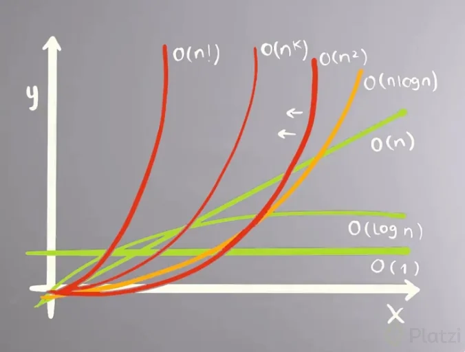

bigO - siempre que nos hablan de esta notaicon, nos hablan del peor caso

Por ejemplo: O(f(n))

O(1) - Constante
O(log n) - Logaritmica
O(n) - Lineal
O(n log n) - Logaritmica lineal
O(n^2) - Cuadratica
O(2^n) - Exponencial
O(n!) - Factorial



EJEMPLO: 
```javascript
Tu algoritmo tiene complejidad logarítmica y 99 valores constantes. ¿Cómo lo describirías con la Big O Notation?

O(log n) + O(99) = O(log n)
```
```javascript
¿Cuál de las siguientes es la complejidad menos eficiente para un algoritmo?

O(n!) - Factorial
```
